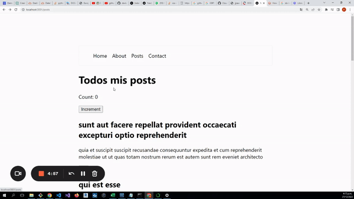

# NEXTjs-13-CC

# Table of Contents
- [NEXTjs-13-CC](#nextjs-13-cc)
- [Table of Contents](#table-of-contents)
- [What is NEXT js](#what-is-next-js)
- [Configuration](#configuration)
  - [pnpm](#pnpm)
  - [Standard linter](#standard-linter)
  - [Steps](#steps)
- [Explanation](#explanation)
  - [next.config.js](#nextconfigjs)
  - [public](#public)
  - [styles](#styles)
    - [global.css](#globalcss)
    - [module css](#module-css)
  - [Routes](#routes)
    - [Dynamic routes](#dynamic-routes)
    - [Params](#params)
  - [Folders without page.jsx](#folders-without-pagejsx)
  - [Fetching data](#fetching-data)
  - [Client components](#client-components)
    - [Hydration](#hydration)
  - [Static generation *getStaticProps*](#static-generation-getstaticprops)
  - [No static generation on fetch, *getServerSideProps*](#no-static-generation-on-fetch-getserversideprops)
  - [*Incremental static regeneration*](#incremental-static-regeneration)
  - [Layouts](#layouts)
  - [Loading](#loading)
    - [Loading with suspense](#loading-with-suspense)
  - [Error handling](#error-handling)

# What is NEXT js 
Next.js is a framework for building fast and powerful web applications using React. It includes a lot of features out of the box, such as:
- Automatic code splitting, filesystem based routing, hot code reloading and universal rendering.
- Server rendering and indexing of dynamic React applications for search engines.
- Static pre-rendering and automatic code splitting for faster page loads.
- Simple client-side routing (page based).

# Configuration

## pnpm
pnpm is a fast, disk space efficient package manager. It is designed to be used in monorepos and as a replacement for npm and yarn. It is written in TypeScript and has first-class support for TypeScript and pnpm workspaces.

To install pnpm, run the following command in your terminal:

```bash
    npm install -g pnpm
```

## Standard linter
Standard is a JavaScript style guide, linter, and formatter. It is very similar to ESLint, but it has a few differences. The main difference is that Standard is opinionated. It comes with a set of rules that you must follow. If you don't follow the rules, Standard will throw an error.

To install Standard, run the following command in your terminal:

```bash
    pnpm install standard -D
```

In order to use standard, when we create a new project we have to add the following code to the *.eslintrc.json* file:

```json
    {
        "extends": ["./node_modules/standard/eslintrc.json", "next/core-web-vitals"]
    }
```

## Steps

1. Create a new project using pnpm as follows:

    ```bash
        pnpm create next-app
    ```

    And follow the instructions.

    When everything is done, we have to delete the folder **pages** and create a new one called **app**, the reason is that it is a new way to create pages in Next.js 13.


# Explanation

## next.config.js

This file is used to configure the Next.js application. 

If we want to use the new way to specify routes, we have to add the following code:

```js
    /** @type {import('next').NextConfig} */
    const nextConfig = {
        experimental: {
            appDir: true, // This is the new way to specify routes
        },
        reactStrictMode: true,
    }

    module.exports = nextConfig

```

## public

This folder is used to store static files, such as images, fonts, etc.

## styles

This folder is used to store the styles of the application. 
`Note: We are going to delete th file Home.module.css because we won't use it.`

### global.css

This file is used to store the global styles of the application.

### module css

We can create a new file called `Navigation.module.css` inside the folder **styles** and add the following code:

```css
    .navigation {
        background-color: #000;
        color: #fff;
        padding: 10px;
    }
```

We use modules to avoid conflicts with other styles.

Then we can import the styles in the file **Navigation.jsx** as follows:

```js
    import styles from '../styles/Navigation.module.css'

    export default function Navigation() {
        return (
            <div className={styles.navigation}>
                <h1>Navigation</h1>
            </div>
        )
    }
```

And there won't be any conflicts with other styles with the same name.

## Routes

In order to detect a page, we have to name the page as `page.jsx`,
When we run the app, next.js will create a file called `layout.jsx` in the folder **app**. This file is used to create the layout of the application and all the routes will be inside this file, including nested routes.

See **layout.jsx** file for more information about how to create routes.

When we need to create a new route we have to create a new folder inside the folder **app** and create a file called `page.jsx` inside the new folder.

For example, if we want to create a new route called **about**, we have to create a new folder called **about** inside the folder **app** and create a file called `page.jsx` inside the folder **about**.

### Dynamic routes

We can create dynamic routes by adding a nested folder with closed brackets, for example, if we want to create a dynamic route called **id**, we have to create a new folder called **[id]** inside the folder **posts** and create a file called `page.jsx` inside the folder **[id]**.

### Params

We can get the params of the dynamic route by using the following code with the word **params**:

```js
    function Post({ params }) {
        const { id } = params

        return (
            <div>Este es mi post especifico del id: {id}</div>
        )
    }
```

## Folders without page.jsx

If we don't want to create a new route, we can create a new folder in the root folder and create it without the file `page.jsx`. This folder will be used to store components that will be used in the routes.

For example, if we want to create a new component called **navigation**, we have to create a new folder called **components** in the root folder and create a file called `Navigation.jsx` inside the folder **components**.

## Fetching data

Usually, when we use normal React, we have to use the `useEffect` hook to fetch data from an API and then we have to use the `useState` hook to store the data in a variable, and all this happens in the **client side**.

But in next js, we want all of this happening in the **server side**.

we can do it this way:

```js
    const fetchPosts = () => {
        return fetch('https://jsonplaceholder.typicode.com/posts')
            .then(response => response.json())
    }

    async function PostsList() {
        const posts = await fetchPosts()

        return posts.slice(0, 10).map(post => (
            <article key={post.id}>
                <h2>{post.title}</h2>
                <p>{post.body}</p>
            </article>
        ))
    }

    export default PostsList
```


## Client components

We have to try client components to be as small as possible, and only those small parts that need to be interactive are the ones that run in the client side.

If we want to use a component in the client side, we have to add *use client* at the top of the code, as follows:

```js
    'use client'

    import { useState } from 'react'

    function LikeButton({id}) {

        const [liked, setLiked] = useState(false)

        return (
            <button onClick={() => setLiked(!liked)}>
                {liked ? '<3': 'Me gusta'}
            </button >
        )
    }

    export default LikeButton
```

### Hydration

When we use client components together with server components we use the word **hydration**.

*Hydration* is the process of converting the server components into client components.

## Static generation *getStaticProps*

We can use static generation to generate static pages, this means that the pages will be generated at build time and will be served from the CDN.

To use static generation we just have to run the following command:

```bash
    pnpm run build
```

`Note: If we have a component like:`

```js
    const fetchPosts = () => {
        return fetch('https://jsonplaceholder.typicode.com/posts')
            .then(response => response.json())
    }
```

The data in the served page will be the same as the data in the build time. So, if we want to change the data, we have to run the command `pnpm run build` again.

## No static generation on fetch, *getServerSideProps*

If we want that every time we visit the page, the data is updated, we have to use the following code using **{ cache: 'no-store' }**:

```js
    const fetchPosts = () => {
        return fetch('https://jsonplaceholder.typicode.com/posts')
            .then(response => response.json(), { cache: 'no-store' })
    }
```

## *Incremental static regeneration*

We can use the word **revalidate** to update the data every time we specify in seconds.

```js
    const fetchPosts = () => {
        return fetch('https://jsonplaceholder.typicode.com/posts')
            .then(response => response.json(), { 
                next: {
                    revalidate: 10 // every 10 seconds the data will be updated
                }
            })
    }
```

## Layouts

We can create a layout for the application by creating a file called `layout.jsx` in the folder **posts**.

When we use a layout we always have to pass the **children** as a prop.

```js
    function PostsLayout({ children }) {
    return (
        <div>
            <h1>Todos mis posts</h1>
            {children}
        </div>
    )
}

export default PostsLayout
```

Layouts always mantain the states of the components. So, if we have a counter with a state in the layout, it will be the same counter in all the pages, until we move from one page to another.

```js
    import Counter from './Counter'

    function PostsLayout({ children }) {
        return (
            <div>
                <h1>Todos mis posts</h1>
                <Counter />
                {children}
            </div>
        )
    }

    export default PostsLayout
```



## Loading

We can create a loading file to show a loading message while the data is being fetched.

To do so, we have to create a file called `loading.jsx` in the folder where we want to show the loading component. **See comments folder**

```js
    function Loading() {
        return (
            <div>Cargando...</div>
        )
    }

    export default Loading
```

And that's it, next js 13 will automatically show the loading component while the data is being fetched.

### Loading with suspense

If there's any reason why we won't be able to use the loading component, we can use the following code:

```js
    import { Suspense } from 'react'

    function PostsList() {
        const posts = await fetchPosts()

        return posts.slice(0, 10).map(post => (
            <article key={post.id}>
                <h2>{post.title}</h2>
                <p>{post.body}</p>
            </article>
        ))
    }

    export default function Posts() {
        return (
            <Suspense fallback={<div>Cargando...</div>}>
                <PostsList />
            </Suspense>
        )
    }
```

## Error handling

We can create an error file to show a loading message while the data is being fetched.

To do so, we have to create a file called `error.jsx` in the folder where we want to show the loading component. **See comments folder**. 

We have to define the file with an 'use client' at the top of the file.

```js
    'use client'

    function Error() {
        return (
            <div>Hubo un error</div>
        )
    }

    export default Error
```